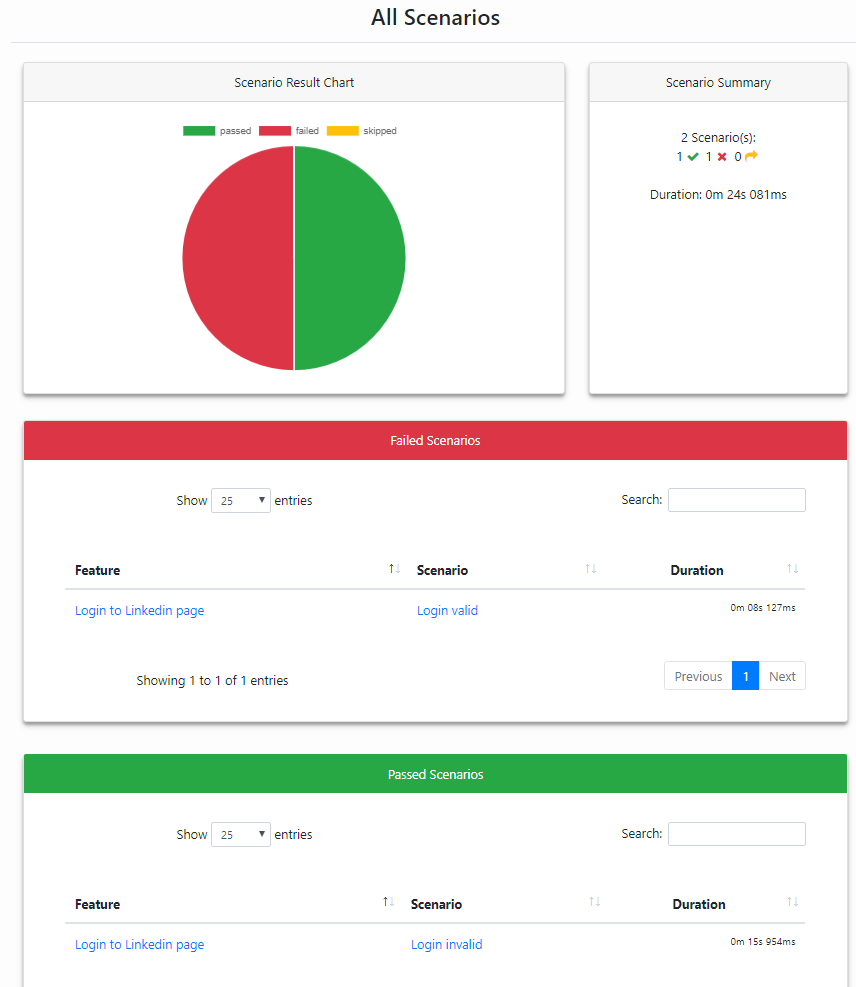

- Edit `config.properties` for your needs
- Run all test cases `mvn clean install -Dmaven.test.failure.ignore=true -Dtest="runner\*.java"`
- Run specific test suite `mvn clean install -Dmaven.test.failure.ignore=true -Dtest="runner\LoginRunner.java"`
- Run with specific browser `mvn clean install -Dmaven.test.failure.ignore=true -Dbrowser=firefox -Dtest="runner\*.java"`
- Run with another url `mvn clean install -Dmaven.test.failure.ignore=true -Durl=http://google.com -Dtest="runner\*.java"`
- JSON report for each suite runner in target/cucumber-report
- Final report (Clucumber Report) in target/generated-report/index.html
- Sample final report

