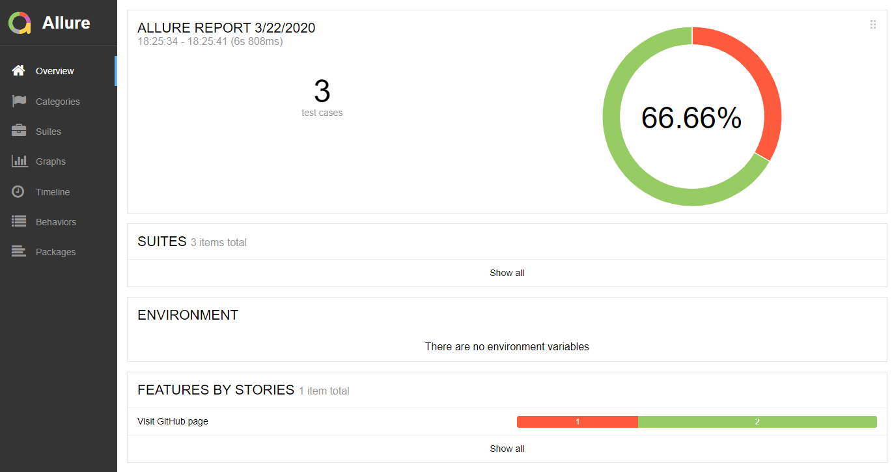

Test framework is written in Python, use selenium + webdrivermanager + behave




Installation
```
    pip instal selenium
    pip install webdrivermanager
    pip install behave
    pip install pyhamcrest
    npm uninstall -g allure-commandline
```

Run test `behave`

Run test with specific browser

`behave -D browser=firefox`

Run test with allure formatter to generate json test results

`behave -f allure_behave.formatter:AllureFormatter -o .\reports .\features`

View report

`allure serve .\reports`

Note: the absolute path of `lib` directory must be added in PYTHONPATH